# User Manual
## Preface
This document contains information about the installation and usage of the [Galène Server](https://galene.org/) automation. The goal of this document
is to enable a user of the software to create a working Galène instance in the Google Cloud. It also outlines the process of how 
to clean up any previously created resources when they are no longer required. 

This is not an extensive reference manual explaining the 
inner workings of Galène or the tools used as part of the automation solution. Where appropriate, references to third party documentation will be included.
Prior knowledge of cloud software or automation solutions is not required to follow through this document. Some of the processes described here are fairly technical, however,
and should be read carefully.

## Terminology
The following list explains some basic terms that are used throughout the text.

- _Automation Solution / IaC Tool_
  
    This project automates the creation of a conference server (Galène) in the Google Cloud. To do so, a specialized tool called 
    "Pulumi" is used. This tool helps to automate the creation of servers and other resources in the cloud using code.
    Such software is commonly referred to as an IaC (Infrastructure as Code) tool. 

- _Deployment_

    A deployment refers to a software or a bundle of components that are installed in some remote location (in this case
    the Galène Server and its components).
  
  
- _Shell_ 
  
    A shell typically refers to a textual environment that allows the user to interact with the system using commands. Depending on 
    the context (especially depending on the operating system used) this is sometimes also referred to as a terminal or command line.
    Throughout this document the term shell is used.

## Structure
There are three main parts to this document:

- _General Information_
    
    Some general information about this project, as well as possible caveats and things to look out for. Read this first.
    

- _Web Based Deployment_

    To use the web based deployment method, only a web browser is required. The creation of a few (free) online accounts 
    might be necessary to complete the necessary steps, though. The guide aims to be fairly detailed in description in order to ease
    the process.
  

- _Deployment from Local Machine_
    
    This type of deployment requires some prerequisites to be installed on the machine that's running the deployment and 
    a certain familiarity with a shell environment. The steps involved in the deployment are described as step-by-step instructions.
    References to third party documentation are given where appropriate. Instructions on shell basics, like setting environment
    variables, are not part of this guide. 

## General Information

The Galéne deployment is fully self-contained. Everything needed to run a web meeting is included. There are a few things to note, though.

To keep things simple, a few decisions were made. For one, there is only one admin user that is always called 'admin'. You will have to set
a password for this user or the deployment will fail. Logging in to the meeting with this account, you will have full control and be able to kick users, etc. All other 
users can log in using whatever alias they like. A password is **not required** for regular users (even though the password field is always visible on the login screen).

Another measure to keep things simple was the integration of only one single meeting room called "meeting". This solution is not meant to support multiple parallel 
meetings on a single instance. 

Per meeting you need to choose a number of participants in order to give the deployment a hint on what kind of server to use in terms
of CPU and memory. A value between 2 and 80 is possible. Entering a lower number will not save you any costs, because 10 users can be supported by the smallest instance 
currently available with this deployment. More than 80 users are currently out of scope for this solution as well. Theoretically this should be possible, but the 
current server sizing options are purely based on interpolation of theoretical data and have not yet been backed up by extensive load testing. For this reason, 80
is a hard coded limit that should work reasonably well. In case you should run into performance issues, it would be interesting to know, as this would help to 
improve the setup.

Last but not least an important topic is SSL. The conference solution only works with secure connections (https) that do require valid SSL certificates. Thankfully,
Galène is able to generate so called "self-signed certificates". Therefore, you do not need to provide your own. However, note that self-signed certificates will lead
to browser warnings when connecting to the meeting site. The reason for this is that the identity of your server cannot be verified. The encryption still works, but 
theoretically someone could be trying to trick the user to connect to a site that's not legitimate. If you would like to avoid such warnings, you may include your own, valid
certificates. You will then also need to update your domain information to point to your Galène servers' IP address, because SSL certificates are bound to specific domains. The IP
can easily be obtained from the deployment. It will be presented to you at the end of the deployment process.

## Web Based Deployment
The web based deployment is the easiest option as it doesn't require any further setup on your local computer. Just a few (free) online accounts will be required.

### Prerequisites
- A [GitHub](https://github.com/) account
- A [Google (Cloud)](https://cloud.google.com/) account (you may use your regular Google account to sign up to Google Cloud)
- A [Pulumi](https://www.pulumi.com/) account (_recommendation:_ use your GitHub account to sign up)

### Step-By-Step Guide
- Make sure to set up the required accounts first. All three services offer a free tier that you can use. Google Cloud will even
grant you 300$ to get started. This should get you through a couple of meetings... Below you will find direct links to the
relevant pages of each service:

  - GitHub: [https://github.com/signup?ref_cta=Sign+up&ref_loc=header+logged+out&ref_page=%2F&source=header-home](https://github.com/signup?ref_cta=Sign+up&ref_loc=header+logged+out&ref_page=%2F&source=header-home)
  - Google Cloud: [https://console.cloud.google.com/freetrial](https://console.cloud.google.com/freetrial)
  - Pulumi: [https://app.pulumi.com/signin?reason=401](https://app.pulumi.com/signin?reason=401)

- Once you're signed up for the services above, it's time to create a project in Google Cloud. Make sure to set **'galene-automation'** as the project's id. For detailed instructions on
how to set up a new project in Goolge Cloud, simply refer to the excellent documentation provided [here](https://cloud.google.com/resource-manager/docs/creating-managing-projects#console).
- Next up, you will need to obtain your own copy of this GitHub repository (a so-called 'fork'). This can easily be accomplished using the GitHub website:
  - Login to GitHub with your account
  - Navigate to the galene_deployment project located here: [https://github.com/bendahl/galene_deployment](https://github.com/bendahl/galene_deployment)
  - Fork the project to your own space by clicking "fork" in the upper left corner. Detailed instructions on forking can be found [in the relevant GiHub documentation](https://guides.github.com/activities/forking/).
  - Now that you've got your own copy of the repo, you will need to provide some basic settings for your deployment.
    - Within your newly forked project, navigate to _"Settings > Secrets > Actions"_.
    - On this page you will now set up a few basic secrets. You can use the button labeled _"New repository secret"_ to do so.
    - The following secrets are mandatory for the setup **(make sure to name your secrets exactly like this, including the use of uppercase and underscores)**:
      - _**GALENE_ADMIN_PASSWORD**:_ The password for the Galène admin user.
      - _**PROJECT_ID**:_ The Google Project ID (should be 'galene-automation').
      - _**GCP_KEY**:_ An access key for the service account linked to your GCP project (refer to ["Creating a new service account key"](#Creating-a-new-service-account-key) below for details on how to obtain such a key).
      - _**PULUMI_ACCESS_TOKEN**:_ This Pulumi access token is needed by the deployment workflow in order to perform actions on your behalf (refer to ["Creating a Pulumi access token"](#Creating-a-Pulumi-access-token) below for details on how to create such a token).
    - If you would like to use our own SSL certificates along with an existing domain, you will also need to set these secrets (you will need to simply copy and paste the file's contents):
      - _**GALENE_SSL_CERTIFICATE**:_ The SSL certificate for your domain (make sure that your certificate file contains the full [chain of trust](https://www.ssl.com/faqs/what-is-a-chain-of-trust/)).
      - _**GALENE_SSL_PRIVATE_KEY**:_ The private key belonging to your certificate.
      - **Important note: If you decide to use your own certificates, you will also need to set up your domain accordingly and make it point to the IP of your Galène instance. Since this process is 
      provider specific you will need to refer to your domain provider's reference in order to find out how to update the relevant records.**
  - At this point your deployment is ready to go. You can now deploy a new Galène instance any time using the "Actions" tab of your GitHub repository. There are two possible actions in total 
  (details on how to run the actions can be found in the paragraph ["Running GitHub actions for Galène"](#Running-GitHub-actions-for-Galène):
    - _**Deploy to cloud:**_ This action will deploy a new Galène server instance in Google Cloud for you. 
    - _**Destroy all Resources:**_ This action will destroy all previously created resources within Google Cloud. **Make sure to run this when you don't need the conferencing server anymore in order to avoid unnecessary costs.**

### Running GitHub actions for Galène
Once you've forked the repository, GitHub should automatically pick up the two actions specified in the directory ".github/workflows". 
They both need to be run manually from the "Actions" tab in your repository. 

To **deploy** the Galène server to Google Cloud, follow these steps:
- Navigate to the "Actions" tab of the galene_deployment repository (your fork of it).
- Just underneath "All Actions" you should see two actions as shown in the following picture:

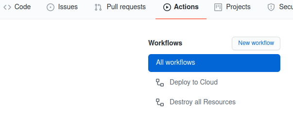

- Click on "Deploy to cloud"
- Click the button "Run Workflow" in the middle right as shown below and choose how many participants will attend the meeting (min: 2, max: 80):

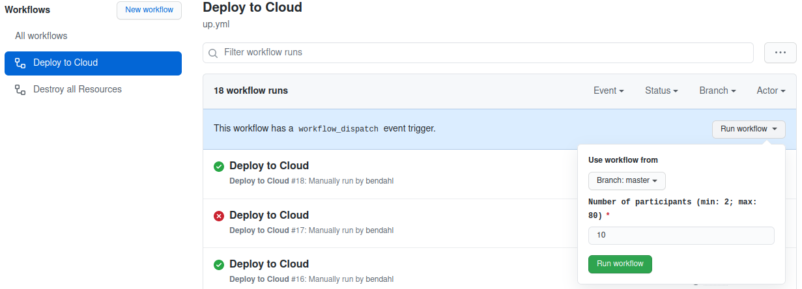

- Click on the green button on the popup screen that is labeled "Run Workflow".
- The deployment will start. The deployment process will take a bit (typically around 1.5 minutes).
- Once the deployment is done, the icon on the list item will change to a green check. 
- There are various ways to view the meeting URL for your instance. The most convenient one is to simply use the Pulumi web interface.
- Log in to Pulumi and click on "Projects > dev" like shown below:

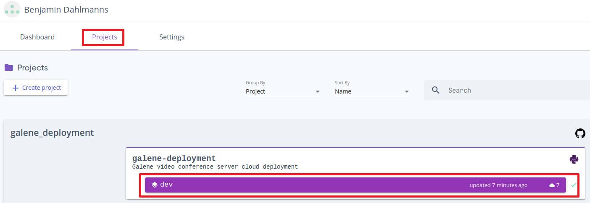

- Within the "Stack" view you will now see an "Outputs" sections that contains all relevant information about your deployment, including the meeting URL.

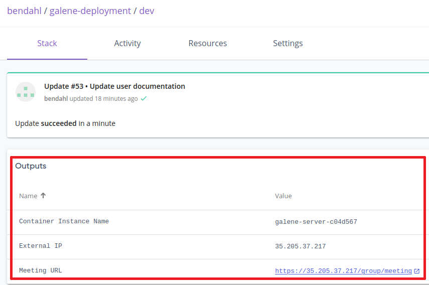

- Click on the meeting link to open the meeting (and make sure to send this link to the meeting participants).
- That's it! The deployment is done. 
* __If you're using your own domain, make sure to update it to match the IP provided in the Outputs and replace the IP
in the meeting URL with your domain.__

  
In order to **shut down** the Galène instance on Google cloud, simply use the "Destroy all Resources" action. The procedure is similar
to the deployment procedure. All you have to do is run the workflow, like before. The only difference is that it is not necessary to
set any parameters for this to work. For the sake of completeness, the basic steps are described below:

- Select the "Destroy all Resources" action by clicking on it.

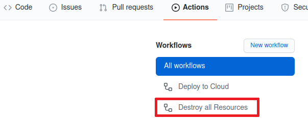

- Click on "Run Workflow" and then again on the green "Run Workflow" button in the popup window.

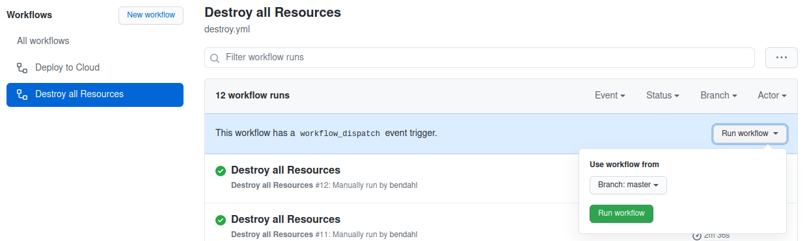

- Wait for the workflow to finish running. This may take a bit.

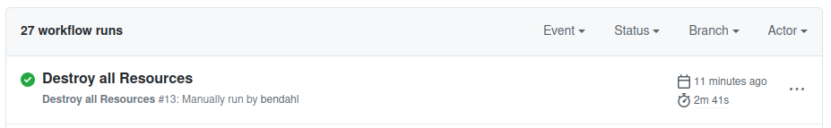

- Upon success, there should be a new workflow run with a green check in the action run list
  (to double-check, you can also take a look at the Pulumi web interface - the Outputs section should be gone
and you will see that "Destroy succeeded in x minutes").

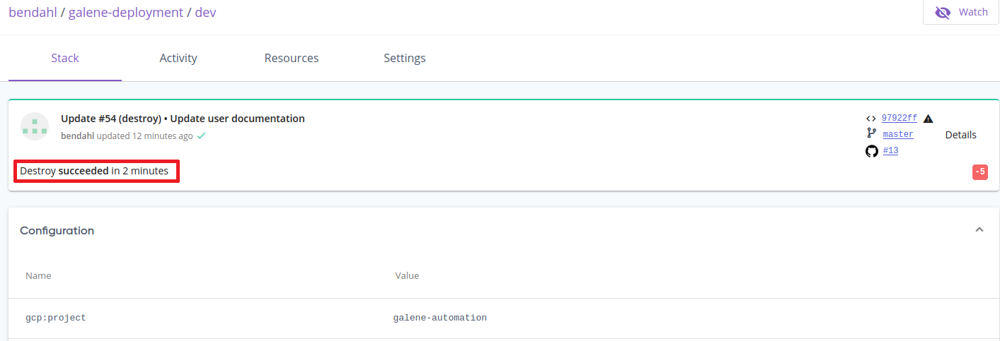

### Creating a new service account key
You will need a so called "Service Account Key" for your Google Cloud project in order to access it programmatically 
(that's what Pulumi is doing in the background). To do so, follow these steps:

- Log in to Google Cloud and go to the "console".
- Click on the hamburger menu (the white stripes) in the upper left corner of the menu bar.

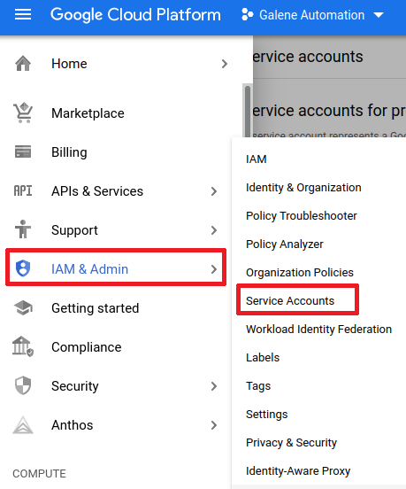

- Select your default service account that's connected to your current project.

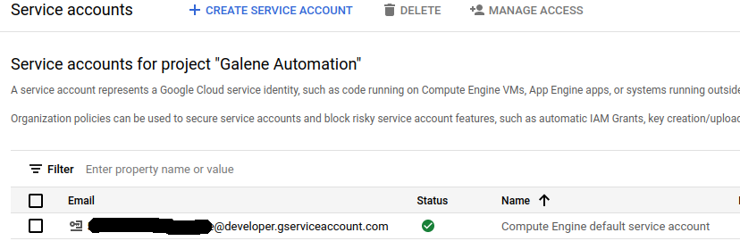

- On the following page, select the "Keys" tab and then "Add keys".

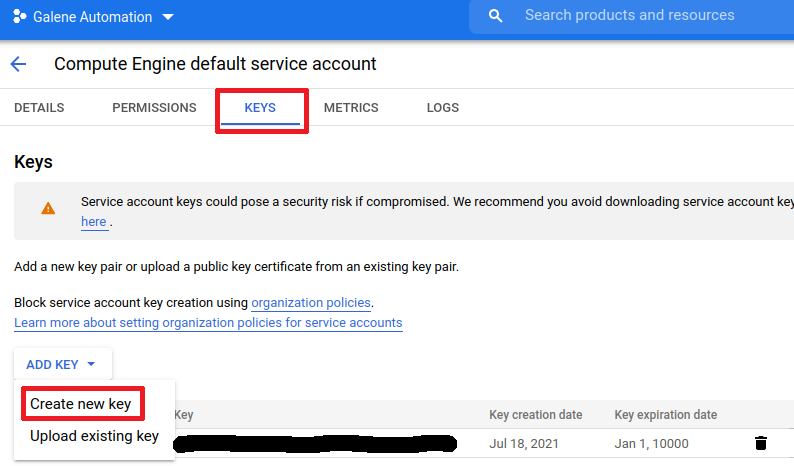

- Make sure to select "json" as the key format. **IMPORTANT: Once you hit "Create" you will be presented with the options to 
either download or open the key file. Make sure to safely store the contents of the file. You will only be able to
access it once.**

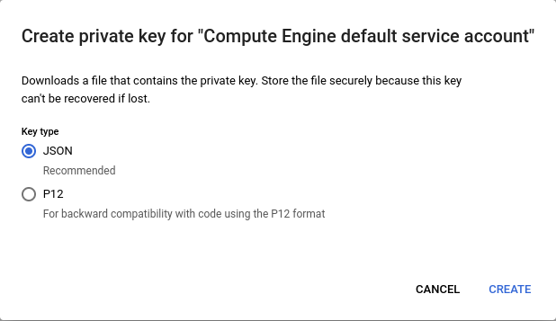

- The service account key can now be used as a secret. Simply copy and paste the complete contents of the file to the __GCP_KEY__ secret
of your repository.

### Creating a Pulumi access token
Similarly to Google Cloud, you will need a token in order to access Pulumi from your GitHub action. Follow these 
steps to create one:

- Log in to your Pulumi account
- Click on "Settings > Access Tokens > Create Token"

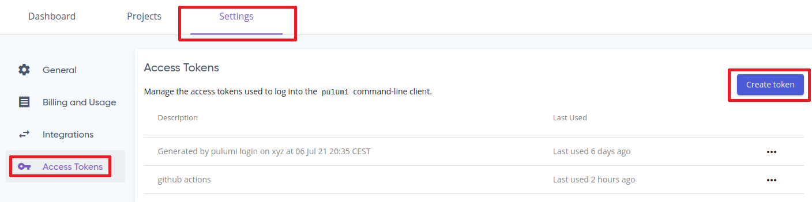

- Enter a description for your token (this can be anything) and hit "Create token".

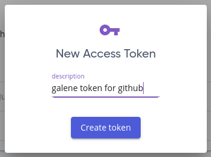

- The token will now be shown to you **exactly once**. Make sure to make a copy of the value 
(simply click on the "copy" symbol, as highlighted in the screenshot). You can use this value as the contents of your
__PULUMI_ACCESS_TOKEN__ secret in the GitHub repository.

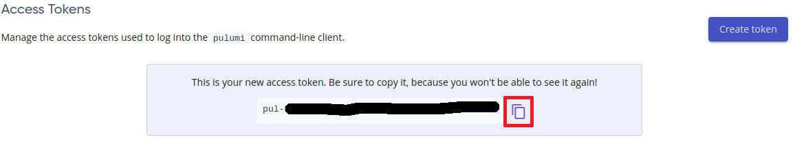

- All done! You now have everything you need to access Pulumi from your GitHub actions.

## Deployment from Local Machine
Note that the local installation will require the use of a shell. If you're not familiar
using such environments, please refer to the web based installation instead. Also, the following setup was tested on Linux.
The shell available on MacOS should behave similarly, but deviations are possible. Using Windows is also possible, but was not
tested either. If you're using a recent version of Windows 10, using the [Windows Subsystem for Linux](https://docs.microsoft.com/en-us/windows/wsl/about) 
should work out of the box and provide the most consistent environment. 

Additional information: If you're planning on using your own SSL certificates with this form of deployment, make sure to check how to base64-encode 
your certificates using your platform's tools. On Linux and MacOSX this should be fairly straight forward using the base64 command line tool. 

Example commands (assuming that you're in a shell and 'my-cert.pem' is the name of your certificate file):

- Printing the contents of the file as a base64 encoded string:
 
`cat my-cert.pem | base64 -`

- Saving the above string to a file called 'my-cert.b64' instead of printing to screen:
 
`cat my-cert.pem | base64 - > my-cert.b64`

- Setting the environment variable 'SSL_CERT' to the base64 encoded string above:
 
`export SSL_CERT=$(cat my-cert.pem | base64 -)`

### Prerequisites
The following software will need to be installed on your local machine:

- [Python 3.8+](https://www.python.org/)
- [Pulumi 3.8.0+](https://www.pulumi.com/docs/get-started/install/)
- [Google Cloud SDK 349.0.0+](https://cloud.google.com/sdk/)
- [Git 2.25.1+](https://git-scm.com/)

### Step-By-Step Guide

**IMPORTANT NOTE**

In order to successfully carry out a deployment via Pulumi as described below, you will need to create a Pulumi account and log in to this account
in your shell. To do so, simply enter `pulumi login`. Alternatively, if you do not wish to use the Pulumi online service, you may use a local
state file. State files contain meta data about a deployment (or "stack" in Pulumi terms) and are vital to correctly deploy and destroy resources.
Using a local state file can be accomplished by "logging in" to Pulumi locally. Simply enter `pulumi login --local` in your shell and all state 
information will be kept locally. 

#### Deployment
- If you do not currently own a Google Cloud account, sign up for a free [Google Cloud account](https://cloud.google.com/).
- Sign in to your Google Cloud account and set up a project on named "galene-deployment". Detailed instructions
on how to create a project in Google Cloud can be found in the [reference documentation](https://cloud.google.com/resource-manager/docs/creating-managing-projects).
- Now that the basic cloud setup is completed, follow the [instructions on how to set up Pulumi for Google Cloud](https://www.pulumi.com/docs/get-started/gcp/begin/).
Make sure to pick your operating system according to your needs and "Python" as a language runtime.
- Once you've completed the basic setup, it's time to clone the [galene_deployment repository from GitHub](https://github.com/bendahl/galene_deployment). You can
either use a graphical Git frontend to do so, or simply use a shell and enter `git clone https://github.com/bendahl/galene_deployment.git`. Alternatively,
  if you've configured an SSH key on GitHub, you may use `git@github.com:bendahl/galene_deployment.git`.
- Navigate to the now locally available `galene_deployment` directory.
- Within the project main directory navigate to the subdirectory `deploy`.
- If you haven't yet opened a shell, it's now time to do so within the current directory.
- Make sure to set the following environment variables:
  - _**ADMIN_PASSWORD**:_ The password for the Galène admin user.
  - _**MAX_USER**:_  Maximum number of users. Default: 10. The value should not exceed 80. The number is used to decide which instance size is needed 
    (more users = more hardware = higher costs). A number less than 10 does not make sense, as it doesn't affect the sizing decision.
  - If you would like to use your own domain and SSL certificates, set up the additional variables mentioned below and make sure to update your DNS information accordingly once 
    the server has been deployed (**note that the content should be base64 encoded to ensure that the values will be forwarded correctly**):
    - _**SSL_CERTIFICATE**:_ The SSL certificate for your domain (make sure that your certificate file contains the full [chain of trust](https://www.ssl.com/faqs/what-is-a-chain-of-trust/)).
    - _**SSL_PRIVATE_KEY**:_ The private key belonging to your certificate
- To deploy Galène to Google Cloud enter `pulumi up`. A short summary outlining the planned changes will appear. Confirm this dialog by 
  selecting "yes" to go through with the deployment.
- After a short while the deployment should be complete and you will be presented with some basic information such as:
    - _**Container Instance Name:**_ The name of your server within Google Cloud.
    - _**External IP:**_ The address at which your server may be contacted from the outside (via Browser, etc...)
    - _**Meeting URL:**_ This is the link to your online meeting room. Use this to enter the meeting. Make sure to send this link to all participants. **If you're using your own domain, 
    make sure to update the relevant DNS entry to match the exernal IP. You should also replace the IP in your meeting URL with your domain name before sending out invitations. 
    The process of updating your DNS entry is not documented here, because different providers handle this differently.**

#### Cleaning Up
When you don't need the meeting room anymore, you should clean up all resources running in the Cloud to reduce cost. To do so, follow these steps:
- In a shell, navigate back to the `galene_deployment/deploy` directory.
- Enter `pulumi destroy -f`
- Wait until the process finishes. **Do not interrupt this process or you might end up with an inconsistent system state.** This can be cleanup up by
Pulumi, but will require extra steps.
